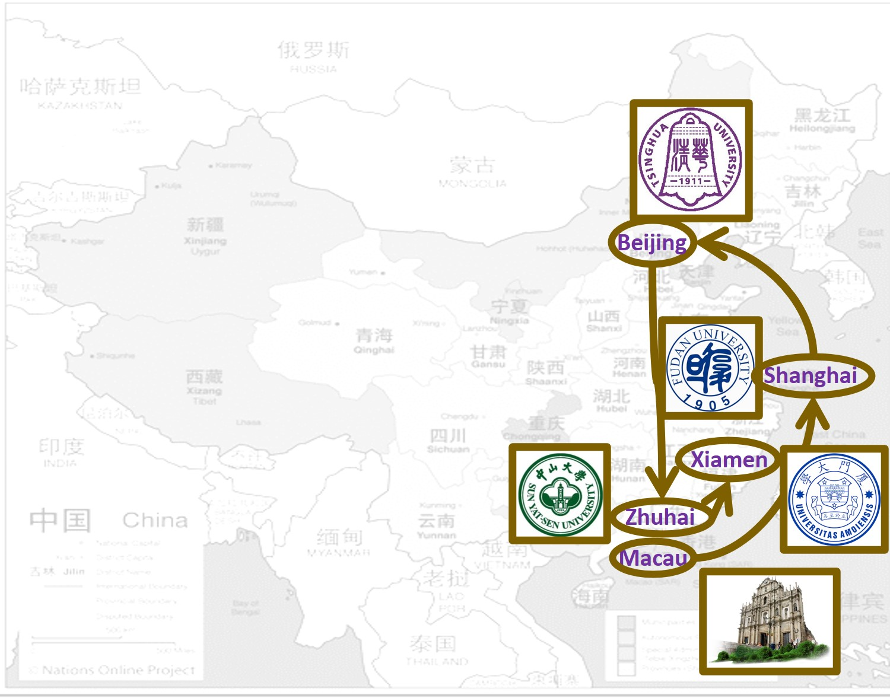

I am currently an assistant professor at the School of Mathematical Sciences, Xiamen University ([faculty website](https://math.xmu.edu.cn/info/1083/6957.htm)). Prior to that, I received my elementary education in Macau SAR (my hometown), then obtained my BSc degree from Fudan University in Shanghai, and both my MSc and PhD degrees from Tsinghua University in Beijing.

​My main research interests focus on the design and analysis of algorithms for combinatorial optimization problems. I am also interested in the real-life problems that appeared in operations research and management science with applications. 

More details are available on the other pages!

Contact me
======
Email: [kmnip@xmu.edu.cn](mailto:kmnip@xmu.edu.cn), [kmnip2004@gmail.com](mailto:kmnip2004@gmail)

Office: Wuji Building, No. 519 (数理/物机大楼 519); Phone: (+86) 0592-2580037

Address: School of Mathematical Sciences, Zengcuo’an West Road, Haiyun Campus, Xiamen University, (曾厝垵西路厦门大学海韵校区)
Xiamen City, Fujian Province, China, 361005

**Last update:** Jul, 2023
